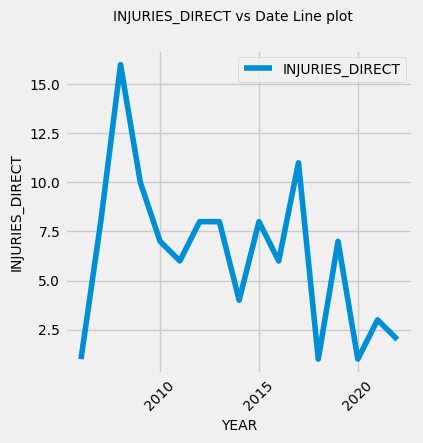
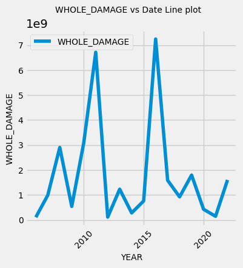
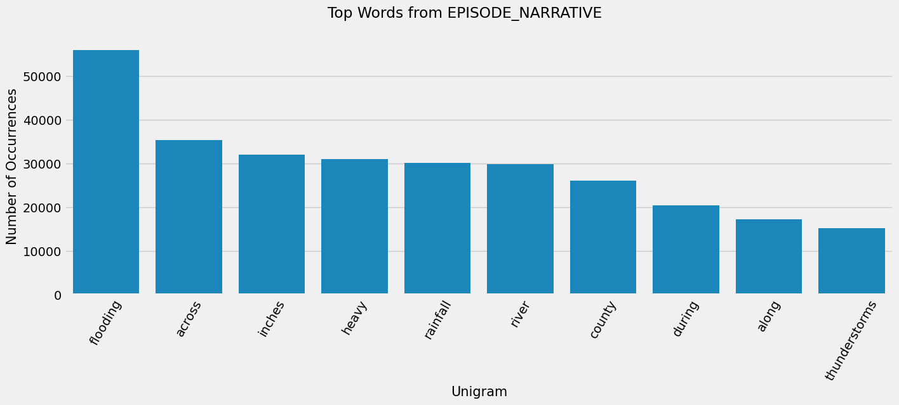
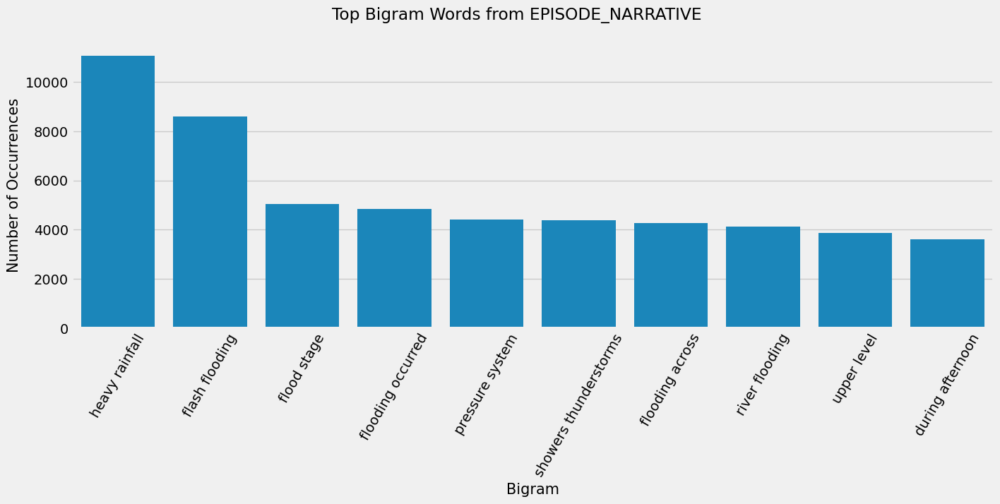
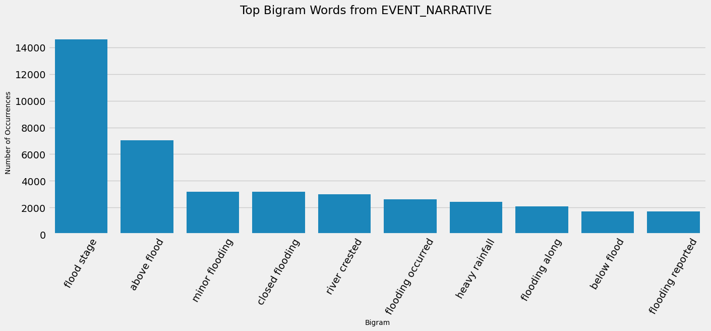

# Boost Climate Risk Modelling with Large Language Models Data Augmentation

Climate change poses a significant threat to global ecosystems and human societies. The resulting effects include extreme weather events, rising sea levels, and disruptions to ecosystems. Predicting the occurrence and impacts of these events is crucial 
for mitigating their consequences and protecting vulnerable communities.

The research has been focused on the flood event type from the US storm events database with data provided by the National Weather Service (NWS) and containing statistics on deaths, injuries and damage estimates. 

By leveraging ChatGPT model (GPT-3.5-turbo), the aim has been to retrieve features from narrative data related to climate events, and specifically, have been employed zero-shot text classification and embeddings techniques used as data augmentation. 

To forecast deaths, injuries, and damages the performance of the baseline Naive method has been compared with several Machine Learning models including Generalized Linear Models (GLM), LightGBM, and Neural Networks. 

### Target Variables Visualization
 
 
 

### Words from Text Features
 
 

### Wordcloud from Text Features
 
 

### Sentiment Anaysis with GenAI
 

### Risk Class with GenAI
 

